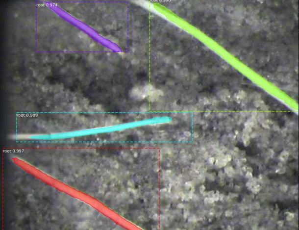
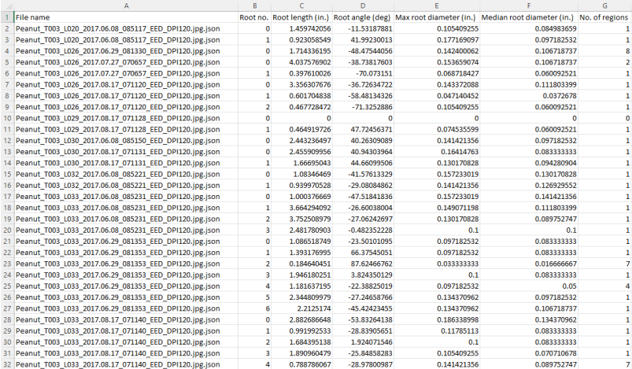

# Roots: Instance Segmentation and Analysis of Plant Roots

Roots is a project that utilizes Mask R-CNN for instance segmentation of plant roots in images. It employs the power of deep learning to identify and segment individual plant roots and provides additional analysis on each segmented root.




## Features

- Instance segmentation of plant roots in images using Mask R-CNN.
- Extraction of individual root instances with pixel-level accuracy.
- Measurement and analysis of various properties for each identified root.
- Visualization of the segmented roots and analysis results.

## Requirements

- Python 3.6.8
- Mask R-CNN implementation (e.g., [Matterport's Mask R-CNN](https://github.com/matterport/Mask_RCNN))
- Additional dependencies listed in `requirements.txt`

## Installation

1. Clone the Roots repository:

    ```shell
    git clone https://github.com/navidali/Roots.git
    cd roots
    ```

2. Install the required dependencies:

    ```shell
    pip install -r requirements.txt
    ```

3. Download the pre-trained Mask R-CNN model weights ([COCO](https://www.google.com/url?sa=t&rct=j&q=&esrc=s&source=web&cd=&ved=2ahUKEwjm4KT3_MP_AhU9fjABHQ6yAO4QFnoECAsQAQ&url=https%3A%2F%2Fgithub.com%2Fmatterport%2FMask_RCNN%2Freleases%2Fdownload%2Fv2.0%2Fmask_rcnn_coco.h5&usg=AOvVaw0nAUAmHpcXDQ6mPgV9NckR)) and place them in the `models/` directory.

## Usage

1. Place your input images or use the existing images in the `dataset/` directory.

2. Run the `root.py` script to perform the training of the model:

    ```shell
    python3 root.py train --dataset=/path/to/root/dataset --weights=coco
    ```
    or add [-h] parameter for other options
    ```shell
    python3 root.py -h
    ```
3. Perform testing on the model:

     ```shell
    python3 root-test.py
    ```

  The segmented root masks and analysis results will be saved to `results.json`

4. Compute the segmented roots and analysis results:
    ```shell
    python3 characterization.py
    ```
  This will output `characterization.csv`  which will contain root length, root angle, max and min root diameters.

## Configuration

The `config.py` file contains configuration options for the Roots project:

- `ROOT_CLASSES`: A list of root classes to detect and segment (e.g., ["taproot", "lateral root"]).
- `IMAGE_SHAPE`: The shape to resize input images for processing (e.g., (512, 512)).
- Other configuration options for the Mask R-CNN model and analysis parameters.

Feel free to modify these configuration options to suit your specific needs.

## Acknowledgments

- The Mask R-CNN implementation by Matterport (https://github.com/matterport/Mask_RCNN)
- The COCO dataset (https://www.google.com/url?sa=t&rct=j&q=&esrc=s&source=web&cd=&ved=2ahUKEwjm4KT3_MP_AhU9fjABHQ6yAO4QFnoECAsQAQ&url=https%3A%2F%2Fgithub.com%2Fmatterport%2FMask_RCNN%2Freleases%2Fdownload%2Fv2.0%2Fmask_rcnn_coco.h5&usg=AOvVaw0nAUAmHpcXDQ6mPgV9NckR)

## Contributors
 Navid Ali, Samia Gilani, Hudhayfah Ilyas, Hannah Soliman, Ammar Syed, Bradon Zhang
